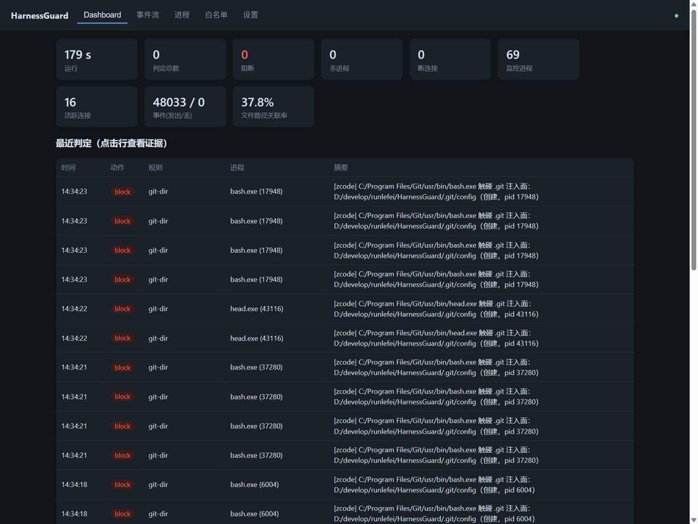
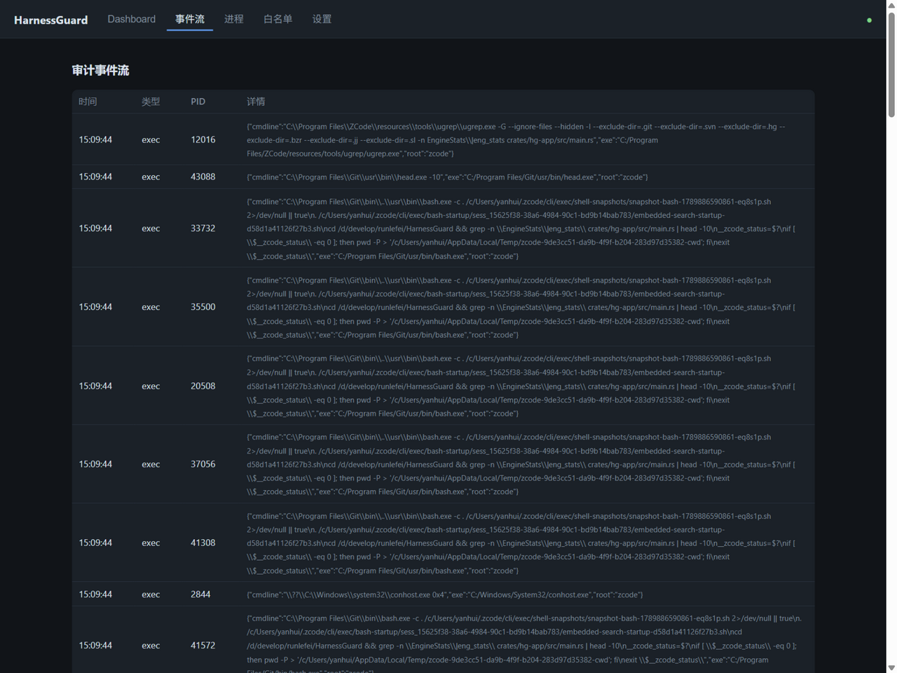
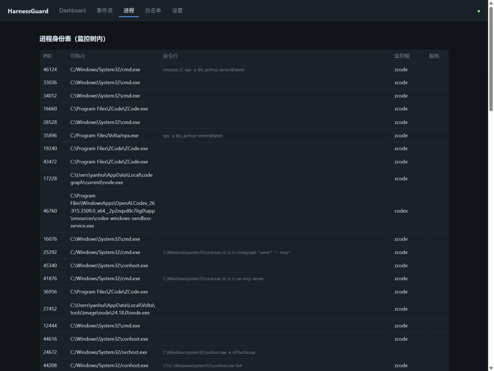
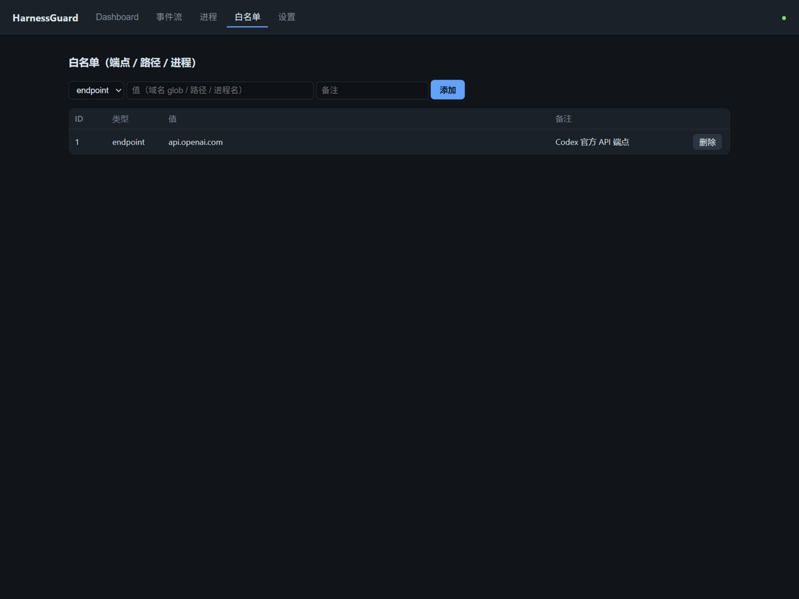
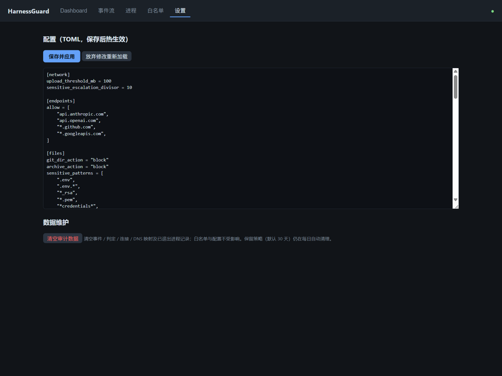

# HarnessGuard

[简体中文](README.md) | English

A local security tool that monitors AI coding harnesses (Claude Code, Codex, Cursor, ZCode, etc.) and detects & blocks attempts to package and exfiltrate your source code and other assets.

## Origin

A public technical investigation revealed that ZCode (by Zhipu) silently uploads the **entire workspace** — packaged and encrypted in the background to the vendor's cloud — as soon as the user logs in. This includes the complete `.git` history (secrets and config files long deleted from the working tree but still recoverable from history). There is no notification, no setting to turn it off, and the encryption keys are held only by the vendor: once uploaded, users cannot even decrypt their own data and lose all control. The behavior is nowhere disclosed in the privacy policy.

This is not a one-off bug but a structural risk of AI coding tools: they hold full read/write access to the user's most valuable asset — the code repository — while the user has zero visibility into what is sent, when, and where. HarnessGuard was built on that premise: instead of trusting vendors' goodwill or privacy policies, it runs as an independent privileged process that continuously monitors and blocks the file, process, and network behavior of these tools, putting control back in the user's hands.

## The Problem It Solves

AI coding tools run with enormous local privileges — full read/write access to the repository, arbitrary command execution, and network access. If such a tool misbehaves (or is steered by malicious instructions), source code, secrets, and other assets can be packaged and exfiltrated silently. HarnessGuard runs as a standalone protection process that continuously monitors the file, process, and network behavior of these tools and blocks threats in real time.

## Core Capabilities

- **Filesystem monitoring (first line of defense)**: detects bulk reads / packaging of source directories
- **Network monitoring (backstop)**: tracks remote endpoints reached by harness processes, identifies and blocks sensitive-data exfiltration
- **Process-tree monitoring**: automatically identifies mainstream harness software and all of their executables, covering arbitrary child processes spawned via nodejs, npm, git, python, etc., as well as scheduled-task/crontab-triggered executions
- **Exemption mechanism**: identity matrix (signature, path, hash) to avoid breaking legitimate operations
- **Response actions**: alerting (OS notifications) + blocking (network/file interception)
- **Web UI**: background service with a browser-based management console

## Web UI

The service ships a localhost-only management console (token auth + Host check). Live screenshots:

**Dashboard — live metrics & recent verdicts**



**Event stream — real-time audit (process spawns / file / network / DNS)**



**Processes — identity table of monitored process trees**



**Allowlist — endpoint / path / process exemptions, hot-reloaded**



**Settings — in-browser config.toml editing, hot-reloaded on save**



## Architecture

Rust workspace with layered crates (dependencies flow downward, acyclic):

```
hg-app                  # assembly & entry point (privileged service)
├─ hg-plat-win / linux / macos   # platform adapters (ETW / eBPF / EndpointSecurity)
├─ hg-web               # Web UI & API (axum)
├─ hg-store             # storage (SQLite)
└─ hg-notify            # OS notification session bridge
   └─ hg-core           # rules engine (fast/slow dual path), process identity table
      └─ hg-model       # unified event model
         hg-platform    # platform abstraction traits
```

Constraints: total RSS ≤ 100MB, low CPU overhead; requires elevated privileges at runtime (kernel-level event sources).

## Current Status

- [x] Requirements & technical design review finalized
- [x] M0: Windows technical validation (ETW event-source feasibility spike)
- [x] M1: Windows end-to-end pipeline (detection → attribution → blocking)
- [x] M4: Windows hardening (installer / self-protection / verification loop; [batch 1 report](docs/20260919-M4第一批报告.md), [re-verification report](docs/20260920-M4第一批复验报告.md), [batch 2 report](docs/20260920-M4第二批报告.md))
- [ ] M2: Linux first compile & calibration (eBPF platform code written, never compiled)
- [ ] M3: macOS compile & calibration (EndpointSecurity, same as above)

## Installation & Uninstall (Windows)

Requires an elevated PowerShell (UAC):

```powershell
cargo build --release
# One-shot install: preflight (elevation/port/BFE) → config generation →
# self-protection ACL (admins may write, users read-only) → service install
# (versioned upgrade if already installed; config & database preserved) → start
.\target\release\harnessguard.exe install

# Web UI (token lives in web-token.txt next to the binary; readable by
# regular users without elevation)
start "http://127.0.0.1:8377/?token=<contents of web-token.txt>"

# Uninstall: stop service (polling) → delete service → remove web-token.txt;
# config/db/logs are preserved (audit data)
.\target\release\harnessguard.exe uninstall
```

- Service: LocalSystem auto-start, three-level restart on failure (`sc qfailure HarnessGuard`)
- Logs: `logs/` in the install directory (daily rotation, 14-day retention; `sc stop` runs the full shutdown sequence)
- Ad-hoc debugging: `harnessguard.exe` (no arguments = console mode; Ctrl+C triggers the full shutdown sequence)

### Configuration (config.toml)

`config.toml` in the install directory (TOML, editable via the Web UI settings page, hot-reloaded): monitored process trees (`processes.harness`), network thresholds (`network.upload_threshold_mb`), endpoint allowlist (`endpoints.allow`), file rules (`files.*`), storage and web port, etc. See [technical design §6](docs/20260919-HarnessGuard技术设计.md) for field reference (Chinese).

### Optional: file audit channel (scenario A hardening)

Under burst load, ~99% of kernel file events never yield a filename (per on-machine verification); `.git` read detection can be strengthened with the Security audit channel (Event ID 4663) — **opt-in**, because enabling it modifies system-wide audit policy (auditpol + SACL):

```powershell
.\target\release\harnessguard.exe enable-file-audit D:\work\repo\.git   # elevated
# Rollback (symmetric auditpol/SACL removal):
.\target\release\harnessguard.exe disable-file-audit D:\work\repo\.git
```

### Linux / macOS

`installer/install.sh` (systemd) and `installer/macos/build-pkg.sh` are M2/M3 placeholders (**never compiled, never verified on real machines**); they will be calibrated once those milestones are reached.

## On-Machine Verification

Verification scripts (elevated PowerShell; see for construction details) live in `demos/`: `m1-demo.ps1` (scenarios B/D end-to-end), `m4-verify.ps1` (M4 main round), `m4-verify3.ps1` (fix verification), `m4-sse-final.ps1` (SSE wrap-up, runs unelevated). The M4 batch-2 verification checklist is in the [batch 2 report](docs/20260920-M4第二批报告.md).

## Documentation

All design documents are written in Chinese.

| Document | Description |
| --- | --- |
| [Requirements](docs/20260919-HarnessGuard需求设计.md) | Threat model, detection rules, capability boundaries (development baseline) |
| [Technical design](docs/20260919-HarnessGuard技术设计.md) | Architecture, modules, interfaces & data design |
| [M0 report](docs/20260919-M0-Windows-spike报告.md) | Windows platform feasibility conclusions |
| [M1 report](docs/20260919-M1-Windows-端到端报告.md) | Windows end-to-end acceptance report |
| [M4 batch 1 report](docs/20260919-M4第一批报告.md) | Windows hardening (SSE/WFP/estats/TaskScheduler/service host) |
| [M4 batch 1 re-verification](docs/20260920-M4第一批复验报告.md) | On-machine re-verification (6 items, 4 rounds) |
| [M4 batch 2 report](docs/20260920-M4第二批报告.md) | Windows wrap-up (estats fallback/attribution race/4663/ACL/logs/installer) |
| [M4 batch 2 re-verification](docs/20260920-M4第二批复验报告.md) | On-machine re-verification (11 items, 10 rounds, 3 fixes applied on the spot) |
| [intro](docs/intro.md) | Original raw requirement notes (historical) |
